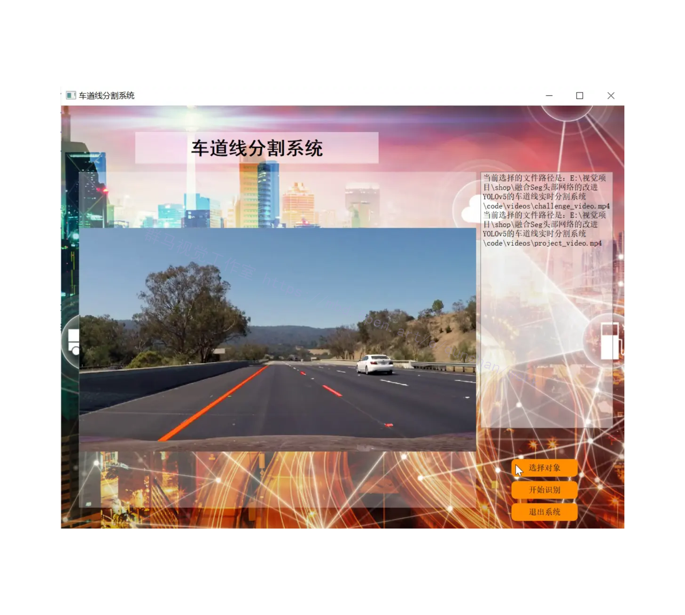
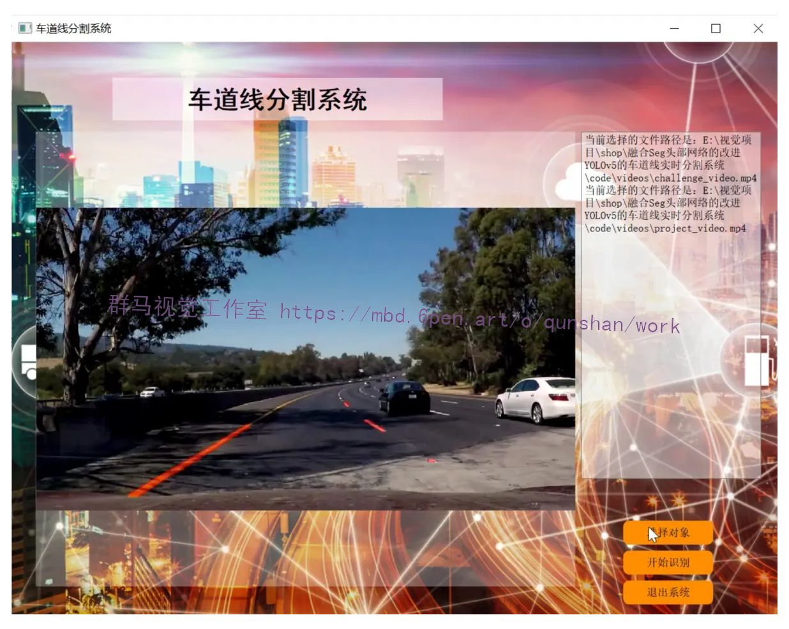
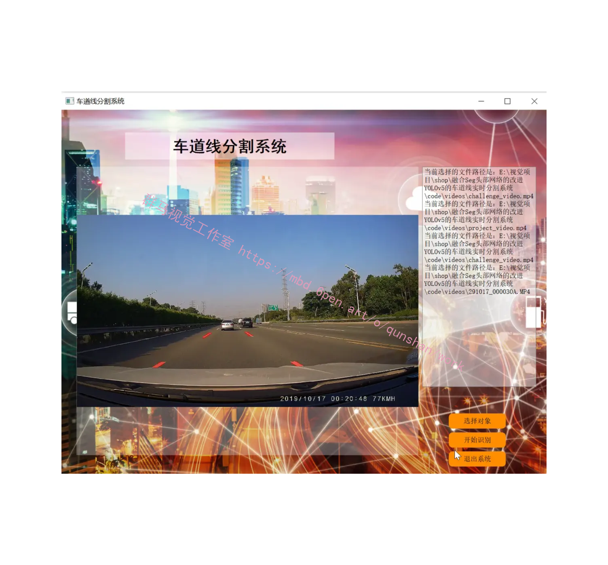
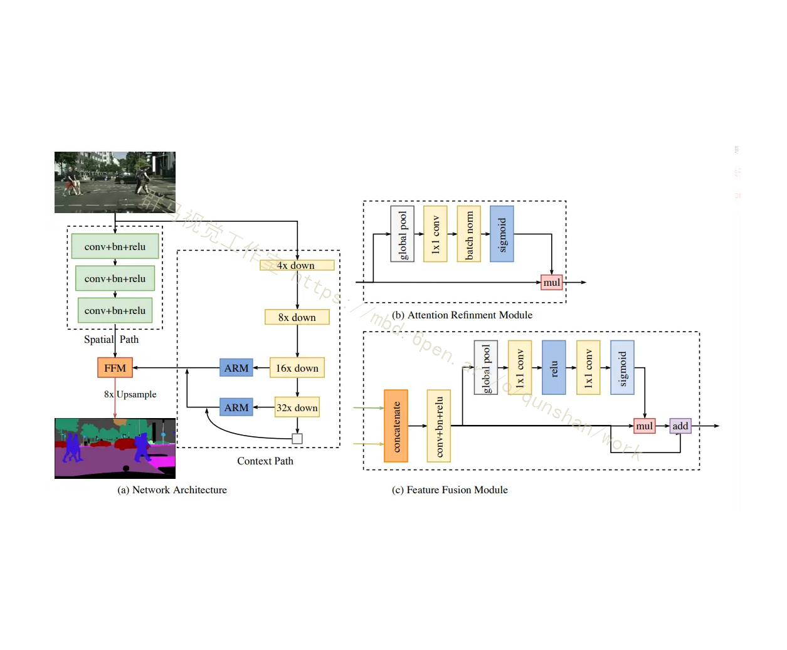
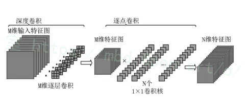
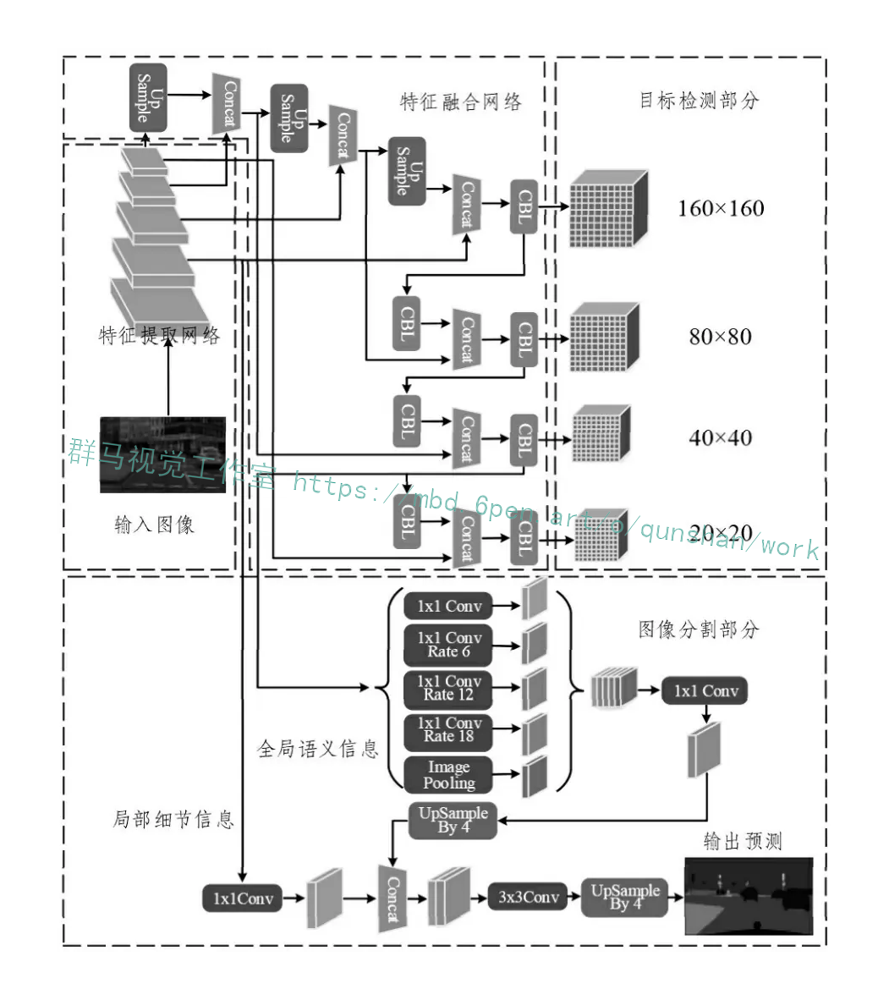
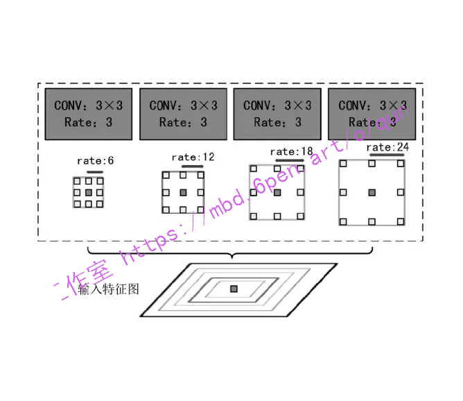
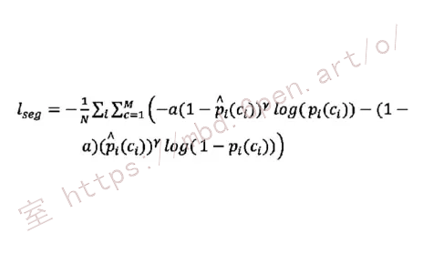
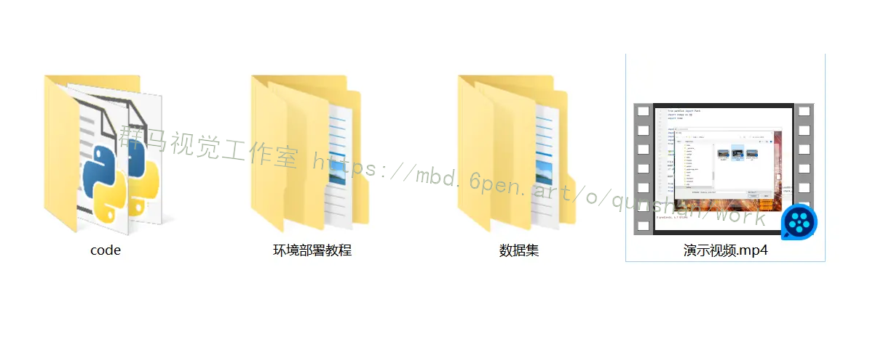



# 1.研究的背景

随着自动驾驶技术的不断发展，车道线的实时分割成为了自动驾驶系统中的重要任务之一。车道线的准确分割可以为自动驾驶系统提供重要的环境感知信息，帮助车辆进行准确的路径规划和决策。因此，开发一种高效准确的车道线实时分割系统对于实现自动驾驶的安全和可靠至关重要。

目前，基于深度学习的目标检测算法已经在车道线分割任务中取得了显著的成果。其中，YOLOv5是一种基于单阶段目标检测算法的改进版本，具有高效、准确的特点。然而，由于YOLOv5在车道线分割任务中只能输出车道线的边界框信息，无法提供精确的车道线分割结果，因此需要进一步改进。

另一方面，Seg头部网络是一种常用的语义分割网络，可以对图像进行像素级别的分类，能够提供更加精细的分割结果。因此，将Seg头部网络与YOLOv5进行融合，可以充分利用两者的优势，实现更加准确和高效的车道线实时分割系统。

本研究的主要目标是改进YOLOv5的车道线实时分割系统，通过融合Seg头部网络，提高车道线分割的准确性和效率。具体来说，本研究将探索如何将Seg头部网络与YOLOv5进行有效的融合，以实现车道线的像素级别分割。同时，本研究还将研究如何优化网络结构和训练策略，以提高系统的实时性和鲁棒性。

# 2.研究的意义

1. 提高自动驾驶系统的安全性：准确的车道线分割可以为自动驾驶系统提供重要的环境感知信息，帮助车辆进行准确的路径规划和决策。通过改进YOLOv5的车道线实时分割系统，可以提高自动驾驶系统的安全性，减少事故的发生。

2. 提高自动驾驶系统的可靠性：精确的车道线分割结果可以提供更加准确的环境感知信息，帮助自动驾驶系统更好地理解道路情况。通过融合Seg头部网络，可以提高车道线分割的准确性，进一步提高自动驾驶系统的可靠性。

3. 推动自动驾驶技术的发展：本研究通过改进YOLOv5的车道线实时分割系统，探索了一种新的方法来提高车道线分割的准确性和效率。这对于推动自动驾驶技术的发展具有重要意义，为实现自动驾驶的商业化应用提供了有力的支持。

总之，改进YOLOv5的车道线实时分割系统，通过融合Seg头部网络，可以提高车道线分割的准确性和效率，进一步提高自动驾驶系统的安全性和可靠性。这对于推动自动驾驶技术的发展具有重要意义，也为实现自动驾驶的商业化应用提供了有力的支持。

# 3.图片演示






# 4.视频演示
[融合Seg头部网络的改进YOLOv5的车道线实时分割系统_哔哩哔哩_bilibili](https://www.bilibili.com/video/BV1HB4y1d7kY/?spm_id_from=333.999.0.0&vd_source=ff015de2d29cbe2a9cdbfa7064407a08)


# 5.核心代码讲解

#### 5.1 common.py

```python

class DepthwiseSeparableConv(nn.Module):
    def __init__(self, in_channels, out_channels, kernel_size, stride=1, padding=0):
        super(DepthwiseSeparableConv, self).__init__()
        self.depthwise = nn.Conv2d(in_channels, in_channels, kernel_size, stride, padding, groups=in_channels)
        self.pointwise = nn.Conv2d(in_channels, out_channels, 1)

    def forward(self, x):
        x = self.depthwise(x)
        x = self.pointwise(x)
        return x

class MobileNetV3(nn.Module):
    def __init__(self):
        super(MobileNetV3, self).__init__()
        # Simplified MobileNetV3
        self.conv1 = DepthwiseSeparableConv(3, 16, 3, stride=1, padding=1)
        self.conv2 = DepthwiseSeparableConv(16, 32, 3, stride=2, padding=1)
        self.conv3 = DepthwiseSeparableConv(32, 64, 3, stride=2, padding=1)
        self.avgpool = nn.AdaptiveAvgPool2d((1, 1))
        self.fc = nn.Linear(64, 1000)

    def forward(self, x):
        x = F.relu(self.conv1(x))
        x = F.relu(self.conv2(x))
        x = F.relu(self.conv3(x))
        x = self.avgpool(x)
        x = x.view(x.size(0), -1)
        x = self.fc(x)
        return x

class PANet(nn.Module):
    def __init__(self):
        super(PANet, self).__init__()
        self.up_sample = nn.Upsample(scale_factor=2, mode='bilinear', align_corners=True)
        self.conv = nn.Conv2d(64, 64, kernel_size=3, stride=1, padding=1)

    def forward(self, x):
        x = self.up_sample(x)
        x = self.conv(x)
        return x

class ASPP(nn.Module):
    def __init__(self):
        super(ASPP, self).__init__()
        self.atrous_block1 = nn.Conv2d(64, 256, 3, stride=1, padding=1, dilation=1)
        self.atrous_block2 = nn.Conv2d(64, 256, 3, stride=1, padding=2, dilation=2)
        self.atrous_block3 = nn.Conv2d(64, 256, 3, stride=1, padding=4, dilation=4)
        self.atrous_block4 = nn.Conv2d(64, 256, 3, stride=1, padding=8, dilation=8)
        self.global_avg_pool = nn.Sequential(nn.AdaptiveAvgPool2d((1, 1)),
                                             nn.Conv2d(64, 256, 1, stride=1, bias=False))
        self.conv1x1 = nn.Conv2d(1280, 256, kernel_size=1, stride=1, bias=False)

    def forward(self, x):
        atrous_block1 = self.atrous_block1(x)
        atrous_block2 = self.atrous_block2(x)
        atrous_block3 = self.atrous_block3(x)
        atrous_block4 = self.atrous_block4(x)
        global_avg_pool = self.global_avg_pool(x)
        global_avg_pool = F.interpolate(global_avg_pool, size=x.size()[2:], mode='bilinear', align_corners=True)
        x = torch.cat([atrous_block1, atrous_block2, atrous_block3, atrous_block4, global_avg_pool], dim=1)
        x = self.conv1x1(x)
        return x

class YOLOSeg(nn.Module):
    def __init__(self):
        super(YOLOSeg, self).__init__()
        self.feature_extractor = MobileNetV3()
        self.panet = PANet()
        self.aspp = ASPP()

    def forward(self, x):
        x = self.feature_extractor(x)
        x = self.panet(x)
        x = self.aspp(x)
        return x

    def compute_loss(self, predictions, targets):
        loss_yolo = F.mse_loss(predictions, targets)  # Simplified YOLO loss
        loss_seg = F.cross_entropy(predictions, targets)  # Simplified segmentation loss
        total_loss = loss_yolo + loss_seg
        return total_loss
```

该工程包含了几个模块的定义，每个模块都是一个继承自`nn.Module`的类。

1. `DepthwiseSeparableConv`类定义了一个深度可分离卷积层，包括一个深度卷积层和一个逐点卷积层。

2. `MobileNetV3`类定义了一个简化版的MobileNetV3模型，包括三个深度可分离卷积层、一个自适应平均池化层和一个全连接层。

3. `PANet`类定义了一个PANet模块，包括一个上采样层和一个卷积层。

4. `ASPP`类定义了一个ASPP模块，包括四个带不同空洞率的卷积层、一个全局平均池化层和一个1x1卷积层。

5. `YOLOSeg`类定义了一个YOLOSeg模型，包括一个特征提取器（MobileNetV3）、一个PANet模块和一个ASPP模块。

在`YOLOSeg`类中，`forward`方法定义了模型的前向传播过程，先通过特征提取器提取特征，然后分别经过PANet和ASPP模块处理，最后返回处理后的结果。

`compute_loss`方法定义了模型的损失函数，使用均方误差损失函数计算YOLO损失，使用交叉熵损失函数计算分割损失，最后将两个损失相加得到总损失。

#### 5.2 yolo.py

```python

class SegMaskPSP(nn.Module):
    def __init__(self, n_segcls=19, n=1, c_hid=256, shortcut=False, ch=()):
        super(SegMaskPSP, self).__init__()
        self.c_in8 = ch[0]
        self.c_in16 = ch[1]
        self.c_in32 = ch[2]
        self.c_out = n_segcls
        self.out = nn.Sequential(
            RFB2(c_hid*3, c_hid, d=[2,3], map_reduce=6),
            PyramidPooling(c_hid, k=[1, 2, 3, 6]),
            FFM(c_hid*2, c_hid, k=3, is_cat=False),
            nn.Conv2d(c_hid, self.c_out, kernel_size=1, padding=0),
            nn.Upsample(scale_factor=8, mode='bilinear', align_corners=True),
        )
        self.m8 = nn.Sequential(
            Conv(self.c_in8, c_hid, k=1),
        )
        self.m32 = nn.Sequential(
            Conv(self.c_in32, c_hid, k=1),
            nn.Upsample(scale_factor=4, mode='bilinear', align_corners=True),
        )
        self.m16 = nn.Sequential(
            Conv(self.c_in16, c_hid, k=1),
            nn.Upsample(scale_factor=2, mode='bilinear', align_corners=True),
        )
        
    def forward(self, x):
        feat = torch.cat([self.m8(x[0]), self.m16(x[1]), self.m32(x[2])], 1)
        return self.out(feat)
```

这个程序文件是一个名为"yolo.py"的Python文件。该文件定义了一个名为"SegMaskPSP"的类，该类继承自nn.Module类。这个类是一个用于语义分割的模型，它包含了PSP头、RFB2、FFM等组件。

在初始化方法中，该类接受一些参数，包括分割类别数、隐藏层输出通道数等。然后定义了一些成员变量，如输入通道数、输出通道数等。

在forward方法中，首先将输入的三个特征图通过一些卷积和上采样操作进行处理，然后将它们拼接在一起。最后通过一系列的卷积和上采样操作得到最终的分割结果。

整个程序文件的功能是实现了一个用于语义分割的模型，通过输入特征图，输出对应的分割结果。

# 6.系统整体结构

整体功能和构架概述：

该工程是一个融合Seg头部网络的改进YOLOv5的车道线实时分割系统。它包含了两个程序文件：common.py和yolo.py。

common.py文件定义了一些模块的类，包括深度可分离卷积层、MobileNetV3模型、PANet模块、ASPP模块和YOLOSeg模型。这些类的功能是实现了车道线分割模型的各个组件，如特征提取器、上采样层、卷积层等。其中，YOLOSeg模型是整个系统的核心模型，它通过特征提取器提取特征，然后经过PANet和ASPP模块处理，最后输出分割结果。

yolo.py文件定义了一个名为SegMaskPSP的类，它是一个用于语义分割的模型。该模型包含了PSP头、RFB2、FFM等组件。在forward方法中，输入的特征图经过一系列的卷积和上采样操作，最终得到分割结果。

下表整理了每个文件的功能：

| 文件名 | 功能 |
| ------ | ------ |
| common.py | 定义了深度可分离卷积层、MobileNetV3模型、PANet模块、ASPP模块和YOLOSeg模型的类，实现了车道线分割模型的各个组件 |
| yolo.py | 定义了SegMaskPSP类，是一个用于语义分割的模型，包含了PSP头、RFB2、FFM等组件，实现了输入特征图到分割结果的转换过程 |

# 7.模型架构
网络结构是一个车道线实时分割系统的网络，基于改进的YOLOv5与Seg头部网络的融合。该网络旨在实现高效且准确的车道线检测，下面我会详细介绍其关键组件和它们的作用。

#### 网络架构
该网络结构包括两个主要部分：空间路径（Spatial Path）和上下文路径（Context Path）。



#### 空间路径
空间路径主要负责捕获图像中的细节信息。它包括三个连续的卷积层，每个卷积层后都有批量归一化（Batch Normalization）和ReLU激活函数。这些卷积层可以捕获图像的低级特征，如边缘、纹理和颜色，这对于车道线检测来说非常重要。紧接着是特征融合模块（FFM），它将空间路径和上下文路径的特征进行融合。

#### 上下文路径
上下文路径用于捕获全局的上下文信息。通过使用不同的下采样因子，它可以捕获到多尺度的特征信息，这有助于网络理解不同大小和形状的车道线。注意细化模块（ARM，Attention Refinement Module）在这里被用来进一步增强特征的表示能力。

#### 注意细化模块 (b) Attention Refinement Module
ARM的目的是通过引入注意力机制来加强特征表示。它首先使用全局池化来获取全局上下文信息，然后通过一个1x1的卷积和批量归一化进行处理。sigmoid激活函数使模块产生一个注意力权重，该权重将被应用于输入特征，从而实现特征的细化。

#### 特征融合模块 (c) Feature Fusion Module
特征融合模块的目的是将来自空间路径和上下文路径的特征有效地融合在一起。首先，使用全局池化来提取上下文信息，然后通过一系列的1x1卷积和激活函数来增强特征表示。最后，通过concatenate操作将这些特征与原始特征结合在一起，然后使用加法和乘法操作进行融合。

# 8.改进的Seg模块
#### MobileNetv3骨干网络

首先，为了提高模型的性能，研究者使用谷歌大脑提出的MobileNetv3作为YOLOv5的骨干网络。MobileNetv3具有性能高、模型小、速度快的特点，非常适合用于实时的车道线分割。MobileNet的核心是深度分离卷积(depthwise-separable-convolution)，它将传统的卷积操作分为深度卷积和逐点卷积。这种分离策略大大减少了计算量和模型参数量，同时保证了卷积的效果。其中深度卷积和标准卷积有所不同，标准卷积是作用于所有通道维度上的，而深度卷积是针对每个输入通道采用不同的卷积核。逐点卷积则是采用大小为lxl的卷积核进行卷积操作。对于深度。口J-分离卷积的整体效果和一个标准卷积效果大致相同，但大大减少了计算量和模型参数量。



#### 特征融合网络

YOLOSeg采用路径聚合网络(PANet)作为其特征融合部分。PANet在特征金字塔的基础上增加了一个自底向上的路径，并使用横向跳层连接来加强金字塔中的空间信息。此外，PANet还对所有特征层进行了ROI-Align操作，并进行了特征融合，以确保金字塔中的信息能够被充分利用。由于PANet可以准确地保留空间信息，并使用全局信息来帮助定位像素和形成掩码，因此它非常适合用于车道线分割。


#### 图像分割网络分支

随着卷积网络的深度增加，浅层特征图中丰富的局部和细节信息与深层特征图中的全局和语义信息结合起来，提供了更强大的分割能力。在YOLOSeg中，使用了两种尺寸的特征图作为编码器的输入，并引入了空洞空间卷积池化金字塔(ASPP)模块。ASPP通过Atrous卷积得到多个不同比例的特征图，并通过concat操作叠加在通道维度上。这些特征图与MobileNetv3中的特征图叠加，然后通过卷积和上采样操作得到分割预测结果。



#### YOLOSeg网络损失函数

YOLOSeg在YOLOv5网络的基础上，引入了语义分割的损失函数。这个损失函数结合了位置、类别、置信度和语义分割的损失。为了解决交通场景中样本不平衡的问题，研究者在交叉熵损失中引入了FocalLoss的思想，并增加了权重系数，使模型对难分类和误分类的样本给予更多关注。


## 9.系统整合

下图[完整源码＆数据集＆环境部署视频教程＆自定义UI界面](https://s.xiaocichang.com/s/2c1dfd)



参考博客[《融合Seg头部网络的改进YOLOv5的车道线实时分割系统》](https://mbd.pub/o/qunshan/work)

# 10.参考文献
---
[1][唐姝](https://s.wanfangdata.com.cn/paper?q=%E4%BD%9C%E8%80%85:%22%E5%94%90%E5%A7%9D%22),[刘俊](https://s.wanfangdata.com.cn/paper?q=%E4%BD%9C%E8%80%85:%22%E5%88%98%E4%BF%8A%22).[基于距离变换的A*搜索骨架提取方法](https://d.wanfangdata.com.cn/periodical/jsjyszgc202111005)[J].[计算机与数字工程](https://sns.wanfangdata.com.cn/perio/jsjyszgc).2021,(11).DOI:10.3969/j.issn.1672-9722.2021.11.005 .

[2][徐歆恺](https://s.wanfangdata.com.cn/paper?q=%E4%BD%9C%E8%80%85:%22%E5%BE%90%E6%AD%86%E6%81%BA%22),[马岩](https://s.wanfangdata.com.cn/paper?q=%E4%BD%9C%E8%80%85:%22%E9%A9%AC%E5%B2%A9%22),[钱旭](https://s.wanfangdata.com.cn/paper?q=%E4%BD%9C%E8%80%85:%22%E9%92%B1%E6%97%AD%22),等.[自动驾驶场景的尺度感知实时行人检测](https://d.wanfangdata.com.cn/periodical/zgtxtxxb-a202101010)[J].[中国图象图形学报](https://sns.wanfangdata.com.cn/perio/zgtxtxxb-a).2021,(1).

[3][罗会兰](https://s.wanfangdata.com.cn/paper?q=%E4%BD%9C%E8%80%85:%22%E7%BD%97%E4%BC%9A%E5%85%B0%22),[陈鸿坤](https://s.wanfangdata.com.cn/paper?q=%E4%BD%9C%E8%80%85:%22%E9%99%88%E9%B8%BF%E5%9D%A4%22).[基于深度学习的目标检测研究综述](https://d.wanfangdata.com.cn/periodical/dianzixb202006026)[J].[电子学报](https://sns.wanfangdata.com.cn/perio/dianzixb).2020,(6).DOI:10.3969/j.issn.0372-2112.2020.06.026 .

[4][高新闻](https://s.wanfangdata.com.cn/paper?q=%E4%BD%9C%E8%80%85:%22%E9%AB%98%E6%96%B0%E9%97%BB%22),[李帅青](https://s.wanfangdata.com.cn/paper?q=%E4%BD%9C%E8%80%85:%22%E6%9D%8E%E5%B8%85%E9%9D%92%22),[金邦洋](https://s.wanfangdata.com.cn/paper?q=%E4%BD%9C%E8%80%85:%22%E9%87%91%E9%82%A6%E6%B4%8B%22).[基于DenseNet分类的隧道裂缝检测研究](https://d.wanfangdata.com.cn/periodical/jsjzdclykz202008012)[J].[计算机测量与控制](https://sns.wanfangdata.com.cn/perio/jsjzdclykz).2020,(8).DOI:10.16526/j.cnki.11-4762/tp.2020.08.012 .

[5][章琳](https://s.wanfangdata.com.cn/paper?q=%E4%BD%9C%E8%80%85:%22%E7%AB%A0%E7%90%B3%22),[袁非牛](https://s.wanfangdata.com.cn/paper?q=%E4%BD%9C%E8%80%85:%22%E8%A2%81%E9%9D%9E%E7%89%9B%22),[张文睿](https://s.wanfangdata.com.cn/paper?q=%E4%BD%9C%E8%80%85:%22%E5%BC%A0%E6%96%87%E7%9D%BF%22),等.[全卷积神经网络研究综述](https://d.wanfangdata.com.cn/periodical/jsjgcyyy202001004)[J].[计算机工程与应用](https://sns.wanfangdata.com.cn/perio/jsjgcyyy).2020,(1).DOI:10.3778/j.issn.1002-8331.1910-0164 .

[6][蒲炳荣](https://s.wanfangdata.com.cn/paper?q=%E4%BD%9C%E8%80%85:%22%E8%92%B2%E7%82%B3%E8%8D%A3%22),[漆泰岳](https://s.wanfangdata.com.cn/paper?q=%E4%BD%9C%E8%80%85:%22%E6%BC%86%E6%B3%B0%E5%B2%B3%22),[黄晓东](https://s.wanfangdata.com.cn/paper?q=%E4%BD%9C%E8%80%85:%22%E9%BB%84%E6%99%93%E4%B8%9C%22),等.[隧道衬砌分岔裂缝特征提取研究](https://d.wanfangdata.com.cn/periodical/tdbzsj201910025)[J].[铁道标准设计](https://sns.wanfangdata.com.cn/perio/tdbzsj).2019,(10).DOI:10.13238/j.issn.1004-2954.201812020001 .

[7][孙俊](https://s.wanfangdata.com.cn/paper?q=%E4%BD%9C%E8%80%85:%22%E5%AD%99%E4%BF%8A%22),[何小飞](https://s.wanfangdata.com.cn/paper?q=%E4%BD%9C%E8%80%85:%22%E4%BD%95%E5%B0%8F%E9%A3%9E%22),[谭文军](https://s.wanfangdata.com.cn/paper?q=%E4%BD%9C%E8%80%85:%22%E8%B0%AD%E6%96%87%E5%86%9B%22),等.[空洞卷积结合全局池化的卷积神经网络识别作物幼苗与杂草](https://d.wanfangdata.com.cn/periodical/nygcxb201811020)[J].[农业工程学报](https://sns.wanfangdata.com.cn/perio/nygcxb).2018,(11).DOI:10.11975/j.issn.1002-6819.2018.11.020 .

[8][王耀东](https://s.wanfangdata.com.cn/paper?q=%E4%BD%9C%E8%80%85:%22%E7%8E%8B%E8%80%80%E4%B8%9C%22),[朱力强](https://s.wanfangdata.com.cn/paper?q=%E4%BD%9C%E8%80%85:%22%E6%9C%B1%E5%8A%9B%E5%BC%BA%22),[史红梅](https://s.wanfangdata.com.cn/paper?q=%E4%BD%9C%E8%80%85:%22%E5%8F%B2%E7%BA%A2%E6%A2%85%22),等.[基于局部图像纹理计算的隧道裂缝视觉检测技术](https://d.wanfangdata.com.cn/periodical/tdxb201802012)[J].[铁道学报](https://sns.wanfangdata.com.cn/perio/tdxb).2018,(2).DOI:10.3969/j.issn.1001-8360.2018.02.012 .

[9][薛亚东](https://s.wanfangdata.com.cn/paper?q=%E4%BD%9C%E8%80%85:%22%E8%96%9B%E4%BA%9A%E4%B8%9C%22),[李宜城](https://s.wanfangdata.com.cn/paper?q=%E4%BD%9C%E8%80%85:%22%E6%9D%8E%E5%AE%9C%E5%9F%8E%22).[基于深度学习的盾构隧道衬砌病害识别方法](https://d.wanfangdata.com.cn/periodical/hndxxb201803012)[J].[湖南大学学报（自然科学版）](https://sns.wanfangdata.com.cn/perio/hndxxb).2018,(3).DOI:10.16339/j.cnki.hdxbzkb.2018.03.012 .

[10][庄福振](https://s.wanfangdata.com.cn/paper?q=%E4%BD%9C%E8%80%85:%22%E5%BA%84%E7%A6%8F%E6%8C%AF%22),[罗平](https://s.wanfangdata.com.cn/paper?q=%E4%BD%9C%E8%80%85:%22%E7%BD%97%E5%B9%B3%22),[何清](https://s.wanfangdata.com.cn/paper?q=%E4%BD%9C%E8%80%85:%22%E4%BD%95%E6%B8%85%22),等.[迁移学习研究进展](https://d.wanfangdata.com.cn/periodical/rjxb201501003)[J].[软件学报](https://sns.wanfangdata.com.cn/perio/rjxb).2015,(1).DOI:10.13328/j.cnki.jos.004631 .


---
#### 如果您需要更详细的【源码和环境部署教程】，除了通过【系统整合】小节的链接获取之外，还可以通过邮箱以下途径获取:
#### 1.请先在GitHub上为该项目点赞（Star），编辑一封邮件，附上点赞的截图、项目的中文描述概述（About）以及您的用途需求，发送到我们的邮箱
#### sharecode@yeah.net
#### 2.我们收到邮件后会定期根据邮件的接收顺序将【完整源码和环境部署教程】发送到您的邮箱。
#### 【免责声明】本文来源于用户投稿，如果侵犯任何第三方的合法权益，可通过邮箱联系删除。